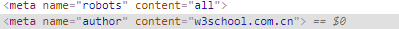

>meta

之前对meta关注度不够，此篇博客写下记录有关meta

**meta>标签的属性定义了与文档相关联的名称/值对**

 

这其实就代表了
~~~
{
    name:all,
    author:w3school.com.cn
}
~~~
 
# meta标签中的一些常用属性：

>###  name：
表示一个key，定义文档级元数据的名称
有以下可能的值

author:文档的作者，在conten中以任意格式去定义
description:内容页面的描述
...
robots:定义搜索引擎的爬虫权限，他的content可能的值有很多，常见的值是all，即允许爬虫获取到页面的所有内容

viewport:这是一个仅仅供移动设备使用的，表示一个初始视口大小的设置，它的值也有很多：

- width：控制 viewport 的大小，可以指定的一个值，如果 600，或者特殊的值，如 device-width 为设备的宽度（单位为缩放为 100% 时的 CSS 的像素）。
- height：和 width 相对应，指定高度。
- initial-scale：初始缩放比例，也即是当页面第一次 load 的时候缩放比例。
- maximum-scale：允许用户缩放到的最大比例。
- minimum-scale：允许用户缩放到的最小比例。
- user-scalable：用户是否可以手动缩放

还有
author，description等
>### charset:
定义页面编码方式，一般是utf-8

>### content:
表示一个value，一般是对应的name或者http-equiv的值

**一般 name和content要同时出现，表示一对键值对**

>### http-equiv:
这个枚举属性定义了能改变服务器和用户行为的编译，同样用content表示其值

>### 它有几个枚举属性,但其中一些已经过时，不再使用了，这里只列举一些仍可用的：
>### content-security-policy：
>指定允许的服务器源和脚本端点，防止xss
>### default-style：
>指定页面中首选的样式文件，在content中是link元素的标题
>### refresh:
>指定重新载入页面的时间或重定向的链接地址
>已过时的属性：content-type,set-cookie(均被http头部属性替代)

